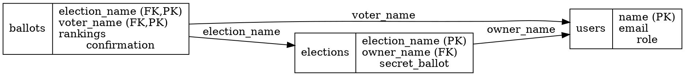
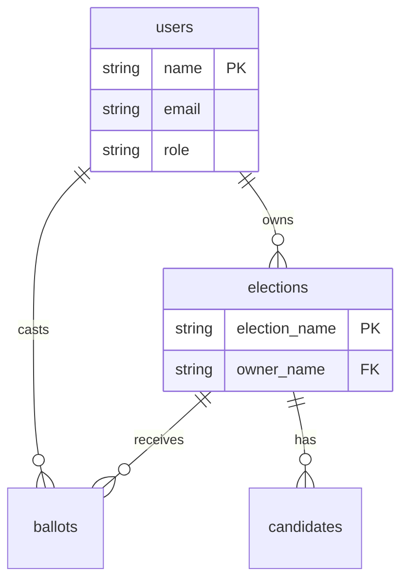

# Schema Diagram Generation - Implementation Complete

## Status: ✅ Phase 1 Complete

Relational model diagrams are now automatically generated from `schema.sql` at build time.

## Goal
Generate relational model diagrams directly from `schema.sql` at build time, similar to how code-structure analyzes bytecode for dependencies.

## Why This Works

Unlike many codebases where relationships are implicit (String parameters, no foreign keys), this project has **explicit foreign keys in schema.sql**:

```sql
FOREIGN KEY (owner_name) REFERENCES users(name) ON DELETE CASCADE
FOREIGN KEY (election_name) REFERENCES elections(election_name) ON DELETE CASCADE
```

This makes parsing straightforward and accurate.

## Proposed Architecture

```
schema.sql (source of truth)
    ↓
SQL Parser (Gradle task)
    ↓
ER Model (in-memory representation)
    ↓
Diagram Generators (GraphViz, Mermaid, HTML)
    ↓
generated/schema-diagram/
    ├── schema.dot (GraphViz)
    ├── schema.svg (rendered)
    ├── schema.mmd (Mermaid)
    └── schema.html (table view)
```

## Implementation Options

### Option 1: Parse SQL Directly (Recommended)

**Pros:**
- Authoritative source (schema.sql defines MySQL backend)
- Explicit foreign keys make relationships obvious
- Simple parsing (regex or simple parser)
- No reflection needed

**Cons:**
- Only captures MySQL schema (not DynamoDB patterns)
- Requires SQL parsing logic

**Gradle Task Sketch:**
```kotlin
tasks.register("generateSchemaDiagram") {
    dependsOn("compileKotlin")

    inputs.file("backend/src/main/resources/database/schema.sql")
    outputs.dir("generated/schema-diagram")

    doLast {
        val schemaFile = file("backend/src/main/resources/database/schema.sql")
        val schema = SqlSchemaParser.parse(schemaFile.readText())

        // Generate multiple formats
        val graphviz = GraphVizGenerator.generate(schema)
        val mermaid = MermaidGenerator.generate(schema)
        val html = HtmlTableGenerator.generate(schema)

        file("generated/schema-diagram/schema.dot").writeText(graphviz)
        file("generated/schema-diagram/schema.mmd").writeText(mermaid)
        file("generated/schema-diagram/schema.html").writeText(html)

        // Render GraphViz to SVG (if dot is installed)
        exec { commandLine("dot", "-Tsvg", "generated/schema-diagram/schema.dot", "-o", "generated/schema-diagram/schema.svg") }
    }
}
```

### Option 2: Reflect on Domain Classes + QueryModel

**Pros:**
- Language-agnostic (works from compiled bytecode)
- Captures domain model as code sees it
- Similar to code-structure approach

**Cons:**
- Relationships are implicit (String parameters, not foreign key objects)
- Requires inference from naming conventions
- More complex than parsing explicit foreign keys

**Would examine:**
```kotlin
// Domain classes
data class User(val name: String, val email: String, ...)
data class Election(val name: String, val ownerName: String, ...)  // ownerName implies FK

// QueryModel signatures
fun searchBallot(voterName: String, electionName: String): BallotSummary?
//               ^^^^^^^^^^           ^^^^^^^^^^^^
//               implies ballot → user, ballot → election relationships
```

**Challenge:** Inference is harder because relationships aren't explicit in code.

### Option 3: Hybrid (SQL + Domain Classes)

Parse SQL for relationships, use domain classes for additional metadata:
- SQL provides structure and foreign keys
- Domain classes provide Kotlin types and documentation
- Cross-validate: does `Election` data class match `elections` table?

## Parsing Strategy (Option 1 - SQL)

### What to Extract from schema.sql

```sql
CREATE TABLE IF NOT EXISTS elections (
    election_name VARCHAR(255) PRIMARY KEY,
    owner_name VARCHAR(255) NOT NULL,
    secret_ballot BOOLEAN,
    ...
    FOREIGN KEY (owner_name) REFERENCES users(name) ON DELETE CASCADE
)
```

**Extract:**
1. **Tables**: `elections`, `users`, `candidates`, etc.
2. **Columns**: name, type, constraints (PK, NOT NULL, UNIQUE)
3. **Primary Keys**: `election_name` in elections
4. **Foreign Keys**: `elections.owner_name → users.name`
5. **Composite Keys**: `(election_name, voter_name)` in ballots

### Simple Regex Patterns

```kotlin
val tablePattern = """CREATE TABLE IF NOT EXISTS (\w+) \(""".toRegex()
val columnPattern = """(\w+)\s+(VARCHAR|BIGINT|BOOLEAN|JSON|TIMESTAMP|INT).*""".toRegex()
val pkPattern = """(\w+)\s+.*PRIMARY KEY""".toRegex()
val fkPattern = """FOREIGN KEY \((\w+)\) REFERENCES (\w+)\((\w+)\)""".toRegex()
```

Or use a proper SQL parser library like JSQLParser.

## Output Formats

### 1. GraphViz (like code-structure)



### 2. Mermaid (GitHub renders natively)



### 3. HTML Table (simple, no dependencies)

```html
<table>
  <tr><th>Table</th><th>Columns</th><th>Foreign Keys</th></tr>
  <tr>
    <td>elections</td>
    <td>election_name (PK), owner_name, ...</td>
    <td>owner_name → users.name</td>
  </tr>
</table>
```

## Comparison to code-structure

| Aspect | code-structure | schema-diagram |
|--------|---------------|----------------|
| **Input** | Compiled bytecode (.class files) | schema.sql (source file) |
| **Analyzes** | Package dependencies | Table relationships (foreign keys) |
| **Extraction** | ASM bytecode reader | SQL parser (regex or library) |
| **Output** | Dependency graph (cycles detected) | ER diagram (relationships shown) |
| **Build Integration** | Gradle task reads .class files | Gradle task reads schema.sql |
| **Cannot Be Stale** | ✅ Reads actual compiled code | ✅ Reads actual schema file |

## Benefits

1. **Always Current**: Diagram regenerated from schema.sql every build
2. **No Drift**: Impossible for diagram to be out of sync with code
3. **Multiple Views**: Generate GraphViz, Mermaid, HTML from same source
4. **Validation**: Could detect orphaned tables, missing foreign keys, etc.
5. **Educational**: Makes relational model visible to newcomers
6. **CI Integration**: Fail build if schema changes but docs not updated

## Recommended Implementation Plan

### Phase 1: Minimal Parser
1. Create `schema-diagram` Gradle subproject
2. Write simple SQL parser (regex-based) for schema.sql
3. Extract tables, columns, primary keys, foreign keys
4. Generate basic GraphViz .dot file

### Phase 2: Multiple Formats
5. Add Mermaid generator
6. Add HTML table generator
7. Render .dot to .svg automatically (if dot installed)

### Phase 3: Enhancements
8. Add cardinality detection (1:1, 1:N, M:N)
9. Color-code entity types (users vs elections vs bridge tables)
10. Add MySQL-specific details (indexes, JSON columns, timestamps)
11. Optionally: Compare with DynamoDB patterns from code

### Phase 4: Validation
12. Detect orphaned tables (no foreign keys)
13. Detect missing indexes on foreign keys
14. Validate naming conventions (all FKs end with _name?)

## Example: What Generated Diagram Would Show

For this codebase:

```
┌─────────┐          ┌───────────┐          ┌─────────┐
│  users  │          │ elections │          │ballots  │
├─────────┤          ├───────────┤          ├─────────┤
│name (PK)│◄────────┤owner_name │          │election │
│email    │          │election_  │◄─────────┤voter    │
│role     │          │  name (PK)│          │rankings │
└─────────┘          └───────────┘          └─────────┘
     ▲                     ▲                       │
     │                     │                       │
     └─────────────────────┴───────────────────────┘
         (eligible_voters, candidates bridge tables)
```

**Relationships visible:**
- elections owned by users (1:N)
- ballots cast by users (1:N)
- ballots in elections (N:1)
- eligible_voters bridges users and elections (M:N)
- candidates belong to elections (N:1)

## Implementation Summary

### What Was Built (Phase 1)

Created `schema-diagram` Gradle module with:

1. **SqlSchemaParser** - Parses `schema.sql` using regex patterns
   - Extracts tables, columns, primary keys, foreign keys
   - Handles composite primary keys
   - Filters out MySQL-specific syntax (INDEX, ENGINE, CHARSET)

2. **GraphVizGenerator** - Generates `.dot` files
   - Entity-relationship diagram with table boxes
   - Columns listed with types and constraints
   - Arrows showing foreign key relationships

3. **MermaidGenerator** - Generates `.mmd` ER diagrams
   - GitHub-native format (renders in markdown)
   - Shows relationships with cardinality notation
   - Color-coded PK/FK annotations

4. **HtmlTableGenerator** - Generates browsable HTML
   - Tables with color-coded keys (PK red, FK blue)
   - Columns with types and constraints
   - Simple, no-dependencies format

5. **Gradle Integration** - Build task `generateSchemaDiagram`
   - Runs automatically during `:schema-diagram:build`
   - Generates all three formats
   - Automatically renders SVG if GraphViz is installed
   - Output to `generated/schema-diagram/`

### Usage

```bash
# Generate diagrams
./gradlew :schema-diagram:generateSchemaDiagram

# Or as part of build
./gradlew :schema-diagram:build
```

Output files:
- `generated/schema-diagram/schema.dot` - GraphViz source
- `generated/schema-diagram/schema.svg` - Rendered diagram
- `generated/schema-diagram/schema.mmd` - Mermaid ER diagram
- `generated/schema-diagram/schema.html` - HTML table view

### What It Captures

From the actual `backend/src/main/resources/database/schema.sql`:

- ✅ 7 tables (event_log, users, elections, candidates, eligible_voters, ballots, sync_state)
- ✅ All columns with types and constraints
- ✅ Primary keys (single and composite)
- ✅ Foreign keys with relationships
- ✅ ON DELETE actions

### Benefits Achieved

1. **Cannot drift** - Regenerated from schema.sql on every build
2. **Multiple formats** - GraphViz, Mermaid, HTML from same source
3. **Zero maintenance** - Automatic, no manual updates needed
4. **Educational** - Makes relational model visible to newcomers
5. **Documentation** - See `schema-diagram/README.md`

### Next Steps (Future Enhancements)

Phase 2-4 improvements could include:
- Cardinality detection (1:1, 1:N, M:N)
- Color-coding entity types
- Cross-validation with DynamoDB patterns
- Naming convention validation
- Orphaned table detection

But Phase 1 delivers the core value: **documentation that cannot become stale**.

This is very practical and is now part of the project documentation!
